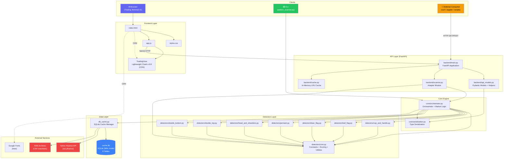
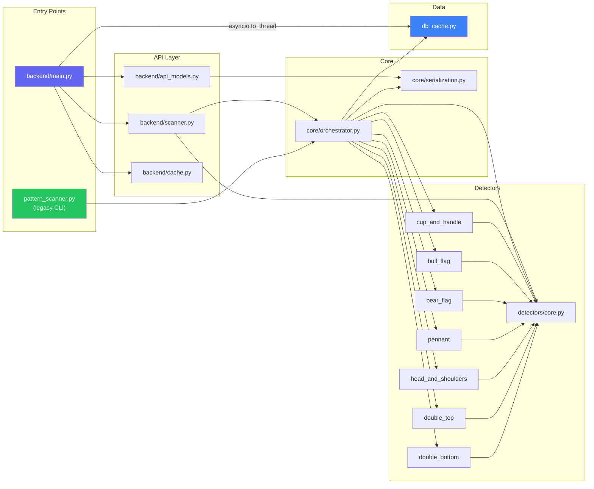
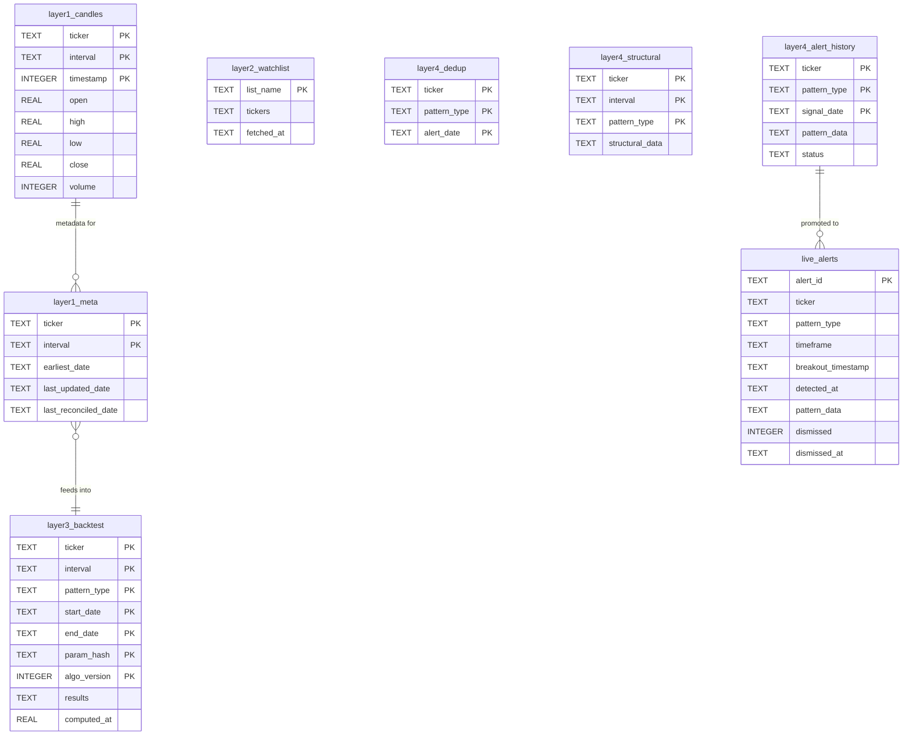
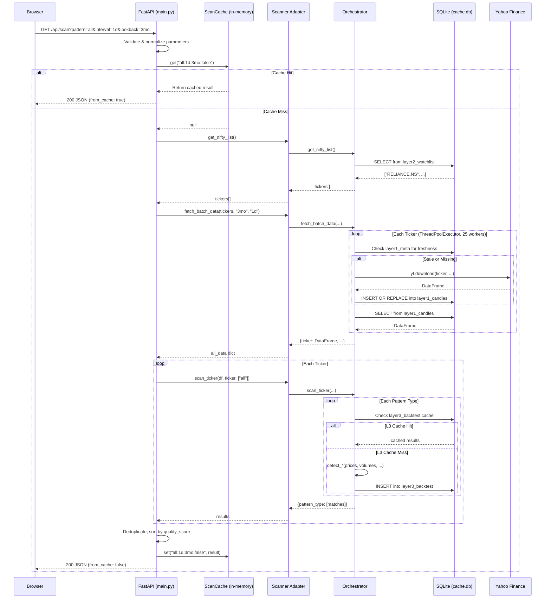
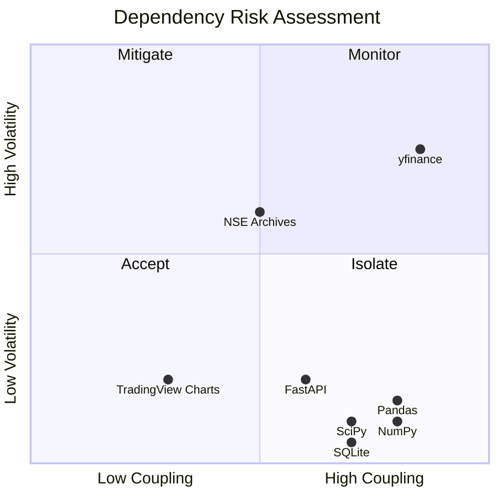
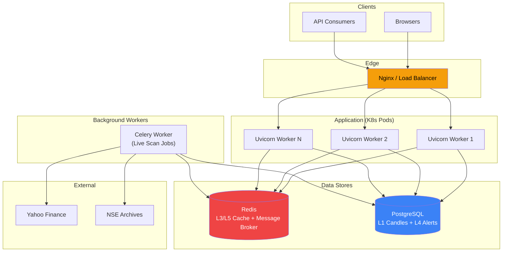

# Technical Architecture Document

## NSE Multi-Pattern Scanner & Trading Terminal v3.0

| Field            | Value                                              |
| ---------------- | -------------------------------------------------- |
| **Author**       | Architecture & Engineering                         |
| **Version**      | 1.0                                                |
| **Last Updated** | 2026-07-14                                         |
| **Status**       | Living Document                                    |
| **Repository**   | `shivamojha23/nse-pattern-scanner`                 |
| **Companion**    | See [PRD.md](PRD.md) for product requirements      |

---

## 1. Architecture Overview

### 1.1 High-Level System Architecture

The system follows a **layered monolith** architecture with clean internal module boundaries. Three independently invocable entry points (Web UI, REST API, CLI) share a common detection engine and data layer.



### 1.2 Key Architectural Characteristics

| Characteristic | Current State |
| --- | --- |
| **Style** | Layered monolith with modular internal boundaries |
| **Coupling** | Loosely coupled layers connected via Python imports and HTTP |
| **Communication** | Synchronous (HTTP request/response for API; direct function calls for CLI) |
| **State Management** | Server-side (SQLite for persistence, in-memory dict for API response caching) |
| **Deployment** | Single-process, single-machine (uvicorn) |
| **Concurrency Model** | Async FastAPI + `asyncio.to_thread()` for blocking I/O (yfinance, SQLite) + `ThreadPoolExecutor` for batch downloads |

---

## 2. Tech Stack & Justification

### 2.1 Current Stack

| Layer | Technology | Version | Justification |
| --- | --- | --- | --- |
| **Runtime** | Python | 3.8+ | Rich scientific computing ecosystem (scipy, numpy, pandas). Dominant in quantitative finance. |
| **API Framework** | FastAPI | ≥ 0.110.0 | Async-first, auto-generates OpenAPI/Swagger docs, Pydantic validation, excellent DX. Chosen over Flask for type safety and async support. |
| **ASGI Server** | Uvicorn | ≥ 0.27.0 | Reference ASGI server for FastAPI. Lightweight, supports `--reload` for development. |
| **Data Source** | yfinance | ≥ 0.2.31 | Free, zero-setup access to Yahoo Finance OHLCV data for NSE tickers. No API key required. |
| **Signal Processing** | SciPy | ≥ 1.11.0 | `find_peaks()` for peak/trough detection, `linregress()` for pole linearity (R²). Industry-standard, heavily tested. |
| **Numerical Computing** | NumPy | ≥ 1.24.0 | Array operations for price analysis, ATR/ADX computation. |
| **Data Manipulation** | Pandas | ≥ 2.0.0 | DataFrame operations, time series resampling, rolling windows, CSV parsing for watchlists. |
| **Database** | SQLite | stdlib (3.x) | Zero-dependency, serverless, perfect for single-user local deployment. WAL mode for concurrent read/write. |
| **Frontend** | HTML / CSS / JS | Vanilla | No build toolchain needed. Single-page app with CSS custom properties for theming. Chosen over React/Vue to eliminate framework overhead for a straightforward dashboard. |
| **Charting** | TradingView Lightweight Charts | 3.8.0 (CDN) | Industry-standard financial charting library. Free, open-source, canvas-based, <50KB gzipped. |
| **Typography** | Inter | Google Fonts CDN | Clean, modern typeface purpose-built for screen UIs. |
| **Testing** | pytest + httpx + freezegun | ≥ 7.0 / ≥ 0.25 / ≥ 1.2.2 | pytest for test discovery and fixtures, httpx via FastAPI's `TestClient` for API integration tests, freezegun for time-dependent tests (market hours, midnight boundaries). |

### 2.2 Planned Additions (Future)

| Technology | Purpose | Phase |
| --- | --- | --- |
| **Docker** | Containerized deployment | Phase 6 |
| **Kubernetes** | Orchestration, horizontal scaling | Phase 6 |
| **Redis** | Distributed caching (replace/supplement SQLite L3–L5) | Phase 6 |
| **PostgreSQL** | Production database (replace SQLite for multi-user) | Phase 6 |
| **Celery** | Background task queue for live scanning | Phase 6 |
| **GitHub Actions** | CI/CD pipeline | Phase 6 |

---

## 3. System Components

### 3.1 Component Map

```
nse-pattern-scanner/
├── backend/                          ← API Layer
│   ├── __init__.py                   ← Package marker
│   ├── main.py              (25 KB)  ← FastAPI app, all endpoint handlers, CORS, static serving
│   ├── api_models.py        (14 KB)  ← Pydantic response models, key-level/check extraction helpers
│   ├── scanner.py            (2 KB)  ← Adapter: re-exports core functions for backend use
│   └── cache.py              (3 KB)  ← In-memory LRU cache with TTL (OrderedDict + threading.Lock)
│
├── core/                             ← Core Engine
│   ├── __init__.py                   ← Package marker
│   ├── orchestrator.py      (25 KB)  ← Multi-pattern scanning orchestration, watchlist, market logic,
│   │                                    batch fetching, live scan dedup, alert history, CLI entry
│   └── serialization.py      (1 KB)  ← numpy/pandas → Python type conversion for JSON serialization
│
├── detectors/                        ← Detection Layer (Strategy Pattern)
│   ├── __init__.py                   ← Package marker
│   ├── core.py              (12 KB)  ← Shared constants (70+), smooth_prices(), compute_quality_score(),
│   │                                    refine_peak/trough(), compute_atr(), compute_adx()
│   ├── cup_and_handle.py    (17 KB)  ← Cup & Handle detector
│   ├── bull_flag.py          (8 KB)  ← Bull Flag detector
│   ├── bear_flag.py          (8 KB)  ← Bear Flag detector
│   ├── pennant.py            (9 KB)  ← Pennant detector
│   ├── head_and_shoulders.py (11 KB) ← Head & Shoulders detector
│   ├── double_top.py         (7 KB)  ← Double Top detector
│   └── double_bottom.py      (7 KB)  ← Double Bottom detector
│
├── frontend/                         ← Presentation Layer
│   ├── index.html            (9 KB)  ← SPA shell: header, controls, chart, panels, live alerts
│   ├── styles.css           (25 KB)  ← Full design system: dark/light themes, glassmorphism, animations
│   └── app.js               (39 KB)  ← All client logic: API calls, chart rendering, state, alerts
│
├── tests/                            ← Test Suite
│   ├── conftest.py           (4 KB)  ← Fixtures: TestClient, snapshot engine, mock_live_alert
│   ├── test_api_snapshots.py (4 KB)  ← Golden-file snapshot tests for all API endpoints
│   ├── test_core_snapshots.py (2 KB) ← Snapshot tests for core engine (fetch, scan, watchlist)
│   ├── test_api_models.py    (1 KB)  ← Unit tests for numpy/pandas serialization
│   ├── test_midnight_assertions.py   ← Time-boundary tests (IST midnight, date parsing)
│   └── snapshots/                    ← 13 golden JSON files for regression testing
│
├── verification/                     ← Archived Verification (Historical)
│   ├── README.md                     ← Documents the refactoring verification process
│   ├── verify_phase1–5.py            ← Phase-by-phase refactoring verification scripts
│   └── smoke_test.py                 ← End-to-end smoke test
│
├── db_cache.py              (16 KB)  ← SQLite cache manager: 5-layer init, CRUD, delta fetch, reconciliation
├── pattern_scanner.py       (73 KB)  ← Legacy monolithic scanner (retained for backward compat)
├── requirements.txt                  ← Production dependencies (6 packages)
├── requirements-dev.txt              ← Development dependencies (3 packages)
├── PRD.md                            ← Product Requirements Document
├── CHEAT_SHEET.md                    ← Visual pattern reference guide
├── README.md                         ← Project overview and usage instructions
└── .gitignore                        ← Git exclusions (cache.db, scratch files, __pycache__)
```

### 3.2 Component Responsibilities

| Component | Responsibility | Design Pattern |
| --- | --- | --- |
| `backend/main.py` | HTTP request handling, parameter validation, response construction, CORS, static file serving | **Controller** |
| `backend/scanner.py` | Bridges the API layer to the core engine by re-exporting functions and constants | **Adapter** |
| `backend/api_models.py` | Data transfer objects (Pydantic), format conversion, key-level/check extraction | **DTO / Mapper** |
| `backend/cache.py` | Time-bounded in-memory result cache with LRU eviction | **Cache-Aside** |
| `core/orchestrator.py` | Scan orchestration, ticker iteration, cache coordination (L3/L4), market-hours logic, dedup | **Orchestrator / Mediator** |
| `core/serialization.py` | Recursive type normalization (numpy → Python) for JSON compatibility | **Utility** |
| `detectors/core.py` | Shared configuration constants, scoring algorithm, peak refinement, ATR/ADX calculation | **Foundation / Shared Kernel** |
| `detectors/*.py` (×7) | Individual pattern detection algorithms with uniform interface: `detect_*(prices, ...) → list[dict]` | **Strategy** |
| `db_cache.py` | 5-layer SQLite persistence: schema init, CRUD, delta fetching, watchlist management, reconciliation | **Repository / Data Access** |
| `frontend/app.js` | Client-side state management, API communication, chart rendering, alert UI, theme toggle | **MVC Controller** (client-side) |
| `frontend/styles.css` | Design system with CSS custom properties, dark/light themes, responsive layout | **Design Tokens** |

### 3.3 Dependency Graph (Import Flow)



---

## 4. Data Model

### 4.1 Database Schema (SQLite — `cache.db`)

The database uses 8 tables organized into 5 logical cache layers. Schema is defined programmatically in [db_cache.py](db_cache.py) `init_db()` — no migration framework is used.



### 4.2 Cache Layer Architecture

| Layer | Table(s) | Purpose | TTL / Invalidation | Data Volume |
| --- | --- | --- | --- | --- |
| **L1 — Raw Candles** | `layer1_candles`, `layer1_meta` | OHLCV price data per ticker/interval | Delta fetch if stale; 7-day corporate action reconciliation | ~90 MB for Nifty 200 (daily, 2 years) |
| **L2 — Watchlist** | `layer2_watchlist` | Nifty 50/100/200 ticker symbol lists | Re-fetched once per trading day (IST date check) | ~4 KB |
| **L3 — Backtest Results** | `layer3_backtest` | Cached pattern detection results per ticker/interval/pattern/date range | 1-hour TTL (`computed_at`); auto-invalidated on `param_hash` or `algo_version` change | ~85 KB per full scan |
| **L4 — Live State** | `layer4_dedup`, `layer4_structural`, `layer4_alert_history` | Live scan deduplication, structural pattern cache, alert lifecycle (active → superseded) | Date-based dedup reset; price-based supersession checks | Grows with live usage |
| **L5 — UI Alerts** | `live_alerts` | Persistent alert state for the frontend (dismiss, history) | User-driven (dismiss action) | Grows with live usage |

### 4.3 In-Memory Cache

| Component | Implementation | Location | TTL | Max Size | Thread Safety |
| --- | --- | --- | --- | --- | --- |
| **API Response Cache** | `ScanCache` (OrderedDict + LRU eviction) | [backend/cache.py](backend/cache.py) | 900s (15 min) | 100 entries | `threading.Lock` |
| **Live Dedup Set** | `_live_alerted_today` (Python set) | [core/orchestrator.py](core/orchestrator.py) | Resets daily (IST date change) | Unbounded | Single-thread access |

### 4.4 Pydantic Response Models

All API responses are typed via Pydantic models defined in [backend/api_models.py](backend/api_models.py):

| Model | Fields | Used By |
| --- | --- | --- |
| `HealthResponse` | `status: str` | `GET /api/health` |
| `MarketStatusResponse` | `is_open`, `status`, `ist_time`, `ist_date`, `next_event` | `GET /api/market_status` |
| `WatchlistResponse` | `count: int`, `tickers: List[str]` | `GET /api/watchlist` |
| `ScanMatch` | `ticker`, `pattern`, `pattern_type`, `signal`, `quality_score`, `key_levels: List[KeyLevel]`, `checks: List[PatternCheck]`, `raw: Dict` | Nested in `ScanResponse` |
| `ScanResponse` | `scan_time`, `interval`, `lookback`, `pattern`, `total_scanned`, `total_with_data`, `matches: List[ScanMatch]`, `scan_duration_seconds`, `from_cache`, `skipped_tickers`, `errors` | `GET /api/scan` |
| `Candle` | `time: Union[int, str]`, `open`, `high`, `low`, `close`, `volume` | Nested in `CandlesResponse` |
| `CandlesResponse` | `ticker`, `interval`, `lookback`, `count`, `candles: List[Candle]` | `GET /api/candles` |
| `LiveAlertItem` | `alert_id`, `ticker`, `pattern`, `pattern_type`, `signal`, `verdict`, `quality_score`, `key_levels`, `checks`, `raw`, `detected_at`, `breakout_timestamp`, `timeframe` | Nested in `LiveScanResponse` / `LiveAlertsResponse` |
| `LiveScanResponse` | `count`, `alerts: List[LiveAlertItem]` | `GET /api/live_scan` |
| `LiveAlertsResponse` | `alerts: List[LiveAlertItem]` | `GET /api/live_alerts` |
| `DismissRequest` | `alert_id: str` | `POST /api/live_alerts/dismiss` |
| `DismissResponse` | `status: str` | `POST /api/live_alerts/dismiss` |

---

## 5. API Design

### 5.1 Endpoint Reference

All endpoints are defined in [backend/main.py](backend/main.py). The API follows REST conventions with JSON responses and auto-generated Swagger documentation at `/docs`.

| Method | Path | Purpose | Query Parameters | Response Model |
| --- | --- | --- | --- | --- |
| `GET` | `/api/health` | Health check | — | `HealthResponse` |
| `GET` | `/api/market_status` | NSE market open/closed with IST time | — | `MarketStatusResponse` |
| `GET` | `/api/watchlist` | Nifty 200 ticker list | — | `WatchlistResponse` |
| `GET` | `/api/scan` | Run pattern scan across watchlist | `pattern`, `interval`, `lookback`, `live_mode` | `ScanResponse` |
| `GET` | `/api/candles` | OHLCV data for one ticker | `ticker` (required), `interval`, `lookback` | `CandlesResponse` |
| `GET` | `/api/live_scan` | Trigger live scan for today's new patterns | `patterns`, `interval`, `lookback` | `LiveScanResponse` |
| `GET` | `/api/live_alerts` | Retrieve all non-dismissed live alerts | — | `LiveAlertsResponse` |
| `POST` | `/api/live_alerts/dismiss` | Dismiss a live alert permanently | Body: `{"alert_id": "..."}` | `DismissResponse` |
| `GET` | `/` | Serve frontend HTML | — | `text/html` |
| `GET` | `/static/{path}` | Serve frontend static assets (CSS, JS) | — | file |
| `GET` | `/docs` | Swagger UI (auto-generated by FastAPI) | — | `text/html` |

### 5.2 Request/Response Flow



### 5.3 Error Handling Strategy

| Scenario | HTTP Status | Behavior |
| --- | --- | --- |
| Invalid pattern name | `400` | `HTTPException` with valid options listed |
| Invalid interval | `400` | `HTTPException` with valid intervals listed |
| Invalid ticker format | `400` | `HTTPException` (regex: `^[A-Z0-9&-]{1,20}(\.NS)?$`) |
| Ticker not found / delisted | `404` | Descriptive message |
| Single ticker scan failure | N/A (200) | Error logged in `errors` dict; other tickers unaffected |
| yfinance download failure | N/A (200) | Ticker added to `errors` dict with reason string |
| Complete data download failure | `200` | Empty `matches[]` with `error` field explaining the issue |
| Server-side exception | `500` | Generic message; traceback printed to server console |

---

## 6. Authentication & Authorization

### 6.1 Current State: None

The application has **no authentication or authorization** system. All endpoints are publicly accessible. This is appropriate for the current deployment model (single-user, localhost).

### 6.2 Security Controls in Absence of Auth

| Control | Implementation |
| --- | --- |
| **Input validation** | All query parameters validated via FastAPI `Query()` with enums and regex |
| **Ticker sanitization** | Regex whitelist: `^[A-Z0-9&-]{1,20}(\.NS)?$` |
| **CORS** | `allow_origins=["*"]` (acceptable for local development) |
| **No write operations on data** | All scan endpoints are read-only; only `/api/live_alerts/dismiss` mutates state |
| **No sensitive data** | No user credentials, PII, or financial account data stored |

### 6.3 Proposed (Future — Phase 7)

| Component | Approach |
| --- | --- |
| **Authentication** | JWT-based access tokens (issued via `/api/auth/login`) |
| **Authorization** | Role-based: `viewer` (scan, view) vs `admin` (configure thresholds, manage watchlists) |
| **Session management** | Stateless JWT with refresh tokens; token stored in `httpOnly` cookie |
| **CORS tightening** | Restrict to specific allowed origins |

---

## 7. Third-Party Integrations & Dependencies

### 7.1 Runtime Dependencies

| Dependency | Version | Integration Point | Communication | Failure Impact |
| --- | --- | --- | --- | --- |
| **Yahoo Finance** (via `yfinance`) | ≥ 0.2.31 | [db_cache.py](db_cache.py) `get_stock_data()`, `_reconcile_corporate_actions()` | HTTPS (yahoo.com API) | **High** — sole data source. Mitigated by L1 cache serving stale data. |
| **NSE Archives** | N/A | [db_cache.py](db_cache.py) `get_cached_watchlist()` | HTTPS (nseindia.com CSV) | **Medium** — hardcoded Nifty 50 fallback + stale L2 cache. |
| **SciPy** | ≥ 1.11.0 | All detectors using `find_peaks`, `linregress` | In-process | **Critical** — no alternative; pattern detection fails completely. |
| **NumPy** | ≥ 1.24.0 | All numerical operations | In-process | **Critical** — foundational dependency. |
| **Pandas** | ≥ 2.0.0 | DataFrame operations, CSV parsing, rolling windows | In-process | **Critical** — foundational dependency. |
| **TradingView Lightweight Charts** | 3.8.0 | [frontend/index.html](frontend/index.html) `<script>` tag | CDN (unpkg.com) | **Low** — charts won't render, but API still works. Could vendor locally. |
| **Google Fonts (Inter)** | N/A | [frontend/index.html](frontend/index.html) `<link>` tag | CDN (fonts.googleapis.com) | **None** — falls back to system sans-serif. |

### 7.2 Development Dependencies

| Dependency | Version | Purpose |
| --- | --- | --- |
| `pytest` | ≥ 7.0.0 | Test runner and fixture framework |
| `httpx` | ≥ 0.25.0 | `TestClient` for FastAPI integration tests |
| `freezegun` | ≥ 1.2.2 | Time mocking for market-hours and midnight-boundary tests |

### 7.3 Dependency Risk Matrix



> **Key risk**: `yfinance` sits in the "Mitigate" quadrant — high coupling (sole data source) with moderate volatility (unofficial API subject to Yahoo's changes). The L1 cache is the primary mitigation.

---

## 8. Scalability & Performance Considerations

### 8.1 Current Performance Profile

| Operation | Measured Latency | Bottleneck |
| --- | --- | --- |
| Health check | < 5ms | None |
| Market status | < 10ms | Datetime computation |
| Watchlist (L2 cached) | < 10ms | SQLite read |
| Full scan — 10 tickers, cold | ~8s | yfinance downloads (network I/O) |
| Full scan — 10 tickers, hot (L3 cached) | ~3.3s | yfinance delta fetch (network I/O) |
| Candle fetch — single ticker, cached | < 200ms | SQLite read + DataFrame construction |
| Pattern detection — single ticker, 7 patterns | ~50ms | CPU (scipy find_peaks, linregress) |

### 8.2 Concurrency Model

```
┌─────────────────────────────────────────────────────────┐
│                    Uvicorn (single worker)               │
│                                                         │
│  ┌──────────────────────────────────────────────────┐   │
│  │           asyncio Event Loop                      │   │
│  │                                                    │   │
│  │  GET /api/scan ─── asyncio.to_thread() ──┐        │   │
│  │                                           │        │   │
│  │  ┌───────────────────────────────────────┐│        │   │
│  │  │   ThreadPoolExecutor (25 workers)      ││        │   │
│  │  │                                        ││        │   │
│  │  │   Thread 1: yf.download(RELIANCE.NS)   ││        │   │
│  │  │   Thread 2: yf.download(TCS.NS)        ││        │   │
│  │  │   Thread 3: yf.download(INFY.NS)       ││        │   │
│  │  │   ...                                  ││        │   │
│  │  │   Thread 25: yf.download(SBIN.NS)      ││        │   │
│  │  └───────────────────────────────────────┘│        │   │
│  │                                           │        │   │
│  │  GET /api/candles ── asyncio.to_thread() ─┘        │   │
│  └──────────────────────────────────────────────────┘   │
│                                                         │
│  SQLite connections: thread-local (threading.local())    │
│  In-memory cache: shared dict with threading.Lock        │
└─────────────────────────────────────────────────────────┘
```

### 8.3 Scaling Bottlenecks & Mitigation

| Bottleneck | Current Impact | Mitigation (Current) | Mitigation (Future) |
| --- | --- | --- | --- |
| **yfinance network I/O** | Dominates cold scan latency | L1 cache + delta fetching reduces calls by ~80% | Batch download in dedicated worker process; add secondary data sources |
| **SQLite write contention** | Low (single user) | WAL mode allows concurrent reads | Replace with PostgreSQL + connection pooling |
| **Single uvicorn worker** | Cannot serve concurrent users | Acceptable for local use | Multi-worker uvicorn behind Nginx; K8s HPA for pod scaling |
| **In-memory cache not shared** | Each worker has its own cache | Single worker = not an issue | Replace with Redis (shared across workers/pods) |
| **200-ticker scan blocks event loop** | Scan endpoint takes 8–30s | `asyncio.to_thread()` offloads to thread pool | Celery background task with polling/WebSocket for results |
| **Full Nifty 200 scan is O(T×P)** | 200 tickers × 7 patterns = 1400 detector invocations | L3 backtest cache eliminates repeat computation | Pre-compute during off-hours; serve from cache during trading hours |

### 8.4 Proposed Production Architecture (Future)



---

## 9. Security Considerations

### 9.1 Threat Model (Current — Local Deployment)

| Threat | Severity | Current Mitigation | Residual Risk |
| --- | --- | --- | --- |
| **SQL Injection** | High | All SQLite queries use parameterized `?` placeholders. No string concatenation. | ✅ Mitigated |
| **Cross-Site Scripting (XSS)** | Medium | No user-generated content rendered in HTML. API returns JSON only. Frontend uses `textContent` for dynamic data (not `innerHTML` with user data). | ✅ Low risk |
| **CORS bypass** | Low | `allow_origins=["*"]` is overly permissive but harmless on localhost | 🟡 Tighten for production |
| **Denial of Service** | Low | No rate limiting. A single scan request can saturate the server for 30s. | 🟡 Add rate limiting for production |
| **Data exfiltration** | None | No sensitive data stored (no user credentials, no financial accounts) | ✅ N/A |
| **Dependency supply chain** | Low | All 6 production deps are well-known, widely-used packages | 🟡 Pin exact versions; use `pip audit` |
| **Ticker injection** | Low | Regex whitelist `^[A-Z0-9&-]{1,20}(\.NS)?$` prevents arbitrary ticker strings | ✅ Mitigated |

### 9.2 Production Hardening Checklist (Future)

- [ ] Restrict CORS to specific origins
- [ ] Add rate limiting (e.g., `slowapi` or Nginx `limit_req`)
- [ ] Pin exact dependency versions in `requirements.txt`
- [ ] Run `pip audit` / `safety check` in CI
- [ ] Add Content-Security-Policy headers
- [ ] Move SQLite to PostgreSQL (prevents filesystem access concerns)
- [ ] Add authentication (JWT)
- [ ] Serve behind HTTPS (TLS termination at Nginx/Ingress)
- [ ] Use `--workers N` with uvicorn (avoid single-worker starvation)

---

## 10. Deployment & Infrastructure

### 10.1 Current Deployment: Local Development

```
┌─────────────────────────────────────────────┐
│                Developer Machine             │
│                                              │
│   $ pip install -r requirements.txt          │
│   $ uvicorn backend.main:app --reload        │
│            --port 8000                       │
│                                              │
│   ┌────────────┐     ┌──────────────────┐   │
│   │  Uvicorn    │────▶│  SQLite cache.db │   │
│   │  (port 8000)│     └──────────────────┘   │
│   └────────────┘                             │
│        │                                     │
│        ▼                                     │
│   http://localhost:8000                       │
└─────────────────────────────────────────────┘
```

| Aspect | Current State |
| --- | --- |
| **Environment management** | Manual (`.venv/` in `.gitignore`) |
| **Configuration** | Hardcoded constants in `detectors/core.py` and `backend/main.py` |
| **Database** | SQLite file (`cache.db`) in project root |
| **Static file serving** | FastAPI `StaticFiles` middleware serves `frontend/` |
| **CI/CD** | None |
| **Monitoring** | None (stdout logging only) |
| **Secrets** | None needed (no API keys, no auth tokens) |

### 10.2 Proposed Deployment: Docker + Kubernetes (Phase 6)

#### Dockerfile (Proposed)

```dockerfile
# --- Proposed, not yet implemented ---
FROM python:3.11-slim
WORKDIR /app
COPY requirements.txt .
RUN pip install --no-cache-dir -r requirements.txt
COPY . .
EXPOSE 8000
CMD ["uvicorn", "backend.main:app", "--host", "0.0.0.0", "--port", "8000", "--workers", "4"]
```

#### docker-compose.yml (Proposed)

```yaml
# --- Proposed, not yet implemented ---
version: "3.8"
services:
  app:
    build: .
    ports:
      - "8000:8000"
    volumes:
      - cache-data:/app/data
    environment:
      - DATABASE_URL=sqlite:///data/cache.db
      - REDIS_URL=redis://redis:6379
    depends_on:
      - redis

  redis:
    image: redis:7-alpine
    ports:
      - "6379:6379"

volumes:
  cache-data:
```

#### CI/CD Pipeline (Proposed — GitHub Actions)

```yaml
# --- Proposed, not yet implemented ---
# .github/workflows/ci.yml
name: CI
on: [push, pull_request]
jobs:
  test:
    runs-on: ubuntu-latest
    steps:
      - uses: actions/checkout@v4
      - uses: actions/setup-python@v5
        with:
          python-version: "3.11"
      - run: pip install -r requirements.txt -r requirements-dev.txt
      - run: pytest tests/ -v
      - run: pip audit
```

---

## 11. Monitoring, Logging & Error Handling

### 11.1 Current State

| Aspect | Implementation | Location |
| --- | --- | --- |
| **Logging** | `print()` statements with emoji prefixes (📦, ✓, ⚠) | Throughout `core/orchestrator.py`, `backend/main.py` |
| **Structured logging** | Not implemented | — |
| **Error handling** | `try/except` per ticker with `traceback.print_exc()` | [backend/main.py](backend/main.py) L344–L350 |
| **Error reporting** | Errors collected in `errors_dict` and returned in API response | [backend/main.py](backend/main.py) `ScanResponse.errors` |
| **Health check** | `GET /api/health` returns `{"status": "ok"}` | [backend/main.py](backend/main.py) L118–L121 |
| **Metrics** | `scan_duration_seconds` included in scan responses | [backend/main.py](backend/main.py) L370 |
| **Uptime monitoring** | None | — |
| **Alerting** | None | — |

### 11.2 Error Isolation Strategy

The system uses a **bulkhead pattern** for scan operations — each ticker is scanned in its own `try/except` block, ensuring one ticker's failure does not abort the entire scan:

```python
# Simplified from backend/main.py
for ticker, df in all_data.items():
    try:
        ticker_results = scan_ticker(df, ticker, patterns_to_scan)
        # ... process results ...
    except Exception as e:
        errors_dict[ticker] = "Internal detection error"
        continue  # ← Other tickers unaffected
```

### 11.3 Proposed Improvements (Future)

| Improvement | Technology | Priority |
| --- | --- | --- |
| **Structured logging** | Python `logging` with JSON formatter | High |
| **Request tracing** | Correlation IDs per request | Medium |
| **Metrics collection** | Prometheus client (`prometheus-fastapi-instrumentator`) | Medium |
| **Dashboard** | Grafana with Prometheus data source | Medium |
| **Error tracking** | Sentry (free tier) | Medium |
| **Uptime monitoring** | Health check polling with alerting | Low |

---

## 12. Trade-offs & Alternatives Considered

### 12.1 Architecture Decisions Record (ADR)

#### ADR-1: SQLite over PostgreSQL

| Aspect | Decision |
| --- | --- |
| **Context** | Need a persistent database for 5-layer caching (candles, watchlists, backtest results, alerts) |
| **Decision** | Use SQLite with WAL mode |
| **Rationale** | Zero-dependency (Python stdlib), no server process, perfect for single-user local deployment. WAL mode allows concurrent reads while writing. |
| **Trade-off** | Cannot scale to multi-user or multi-worker deployment without replacing with PostgreSQL. |
| **Status** | ✅ Active (will be replaced in Phase 6) |

#### ADR-2: Rule-Based Detection over Machine Learning

| Aspect | Decision |
| --- | --- |
| **Context** | Need to detect 7 chart patterns with high interpretability |
| **Decision** | Use geometric rules (thresholds, scipy `find_peaks`, `linregress`) |
| **Rationale** | Fully interpretable — every detection decision can be traced to specific price levels and volume checks. No training data needed. Each PASS/FAIL check is displayed to the user. |
| **Trade-off** | Thresholds are empirically tuned, not learned from data. May miss patterns that don't fit rigid geometric definitions. |
| **Status** | ✅ Active (explicit non-goal to add ML per PRD) |

#### ADR-3: Vanilla Frontend over React/Vue

| Aspect | Decision |
| --- | --- |
| **Context** | Need an interactive dashboard with charts, lists, and real-time alerts |
| **Decision** | Use vanilla HTML/CSS/JS (no framework, no build step) |
| **Rationale** | The UI is a single page with 3 panels — the complexity doesn't justify a framework. Eliminates Node.js toolchain. TradingView Lightweight Charts is vanilla-JS-native. Entire frontend is 3 files (72 KB total). |
| **Trade-off** | State management is manual (global variables). No component reuse system. Adding complex features (e.g., multi-page routing, forms) would benefit from a framework. |
| **Status** | ✅ Active |

#### ADR-4: In-Memory LRU Cache over Redis

| Aspect | Decision |
| --- | --- |
| **Context** | Need to avoid redundant scan computation for rapid repeat requests |
| **Decision** | Use a Python `OrderedDict` with TTL and LRU eviction (`backend/cache.py`) |
| **Rationale** | Zero-dependency. Single-worker deployment means all requests share the same process memory. 15-minute TTL is appropriate for stock data. |
| **Trade-off** | Cache is lost on server restart. Not shared across workers. |
| **Status** | ✅ Active (will be supplemented by Redis in Phase 6) |

#### ADR-5: Adapter Pattern for Backend ↔ Core Boundary

| Aspect | Decision |
| --- | --- |
| **Context** | The core engine (`core/orchestrator.py`) was refactored from a monolith (`pattern_scanner.py`). The API layer needs to call core functions. |
| **Decision** | Create `backend/scanner.py` as a thin adapter that re-exports core functions |
| **Rationale** | Decouples the API layer from the core module's internal structure. If the core is reorganized, only the adapter changes. The API code never imports from `core/` or `detectors/` directly. |
| **Trade-off** | One extra indirection layer. Could become stale if core API changes. |
| **Status** | ✅ Active |

#### ADR-6: Snapshot Testing over Unit Assertions

| Aspect | Decision |
| --- | --- |
| **Context** | Pattern detection output is complex (nested dicts with 30+ fields). Writing individual assertions per field is impractical and fragile. |
| **Decision** | Custom golden-file snapshot testing system (`tests/conftest.py`) |
| **Rationale** | Snapshots capture the full output structure. Any unintended change triggers a diff. `--update-snapshots` flag allows interactive review. Dynamic fields (`scan_time`, `detected_at`) are sanitized. |
| **Trade-off** | Snapshots can be opaque — a passing test doesn't explain *why* the output is correct. Must be paired with manual verification of initial snapshot correctness. |
| **Status** | ✅ Active |

### 12.2 Alternatives Not Chosen

| Alternative | Reason Not Chosen |
| --- | --- |
| **Flask** (instead of FastAPI) | No async support, no auto Swagger, no Pydantic integration |
| **Django** | Too heavy for a single-purpose API; ORM not needed for cache-only data |
| **MongoDB** | Schema-less is a disadvantage for well-structured candle data; SQLite is simpler |
| **TA-Lib** (for technical indicators) | Requires C library installation (platform-dependent). SciPy provides equivalent functionality for the specific algorithms needed (find_peaks, linregress). |
| **Plotly / Matplotlib** (for charts) | Server-side rendering adds latency and complexity. TradingView Lightweight Charts runs entirely in the browser with interactive zoom/pan. |
| **WebSockets** (for live alerts) | 60-second polling is sufficient for 15m+ candle patterns. WebSocket adds connection management complexity with minimal UX benefit. |

---

## 13. Open Technical Risks / Questions

### 13.1 Risks

| # | Risk | Severity | Likelihood | Current Mitigation | Recommended Action |
| --- | --- | --- | --- | --- | --- |
| **R1** | **yfinance API instability** — unofficial wrapper subject to Yahoo's API changes; rate limiting during batch downloads of 200 tickers | 🔴 High | Medium | L1 cache reduces API calls by ~80%. Concurrent downloads via ThreadPoolExecutor. | Add secondary data source (NSE Bhavcopy / Alpha Vantage) for failover. Monitor yfinance release notes. |
| **R2** | **Legacy monolith coexistence** — `pattern_scanner.py` (73 KB) still exists alongside the refactored modular code, creating confusion about which is canonical | 🟡 Medium | Confirmed | README documents the web entry point (`backend.main`). `.gitignore` excludes scratch files. | Remove or deprecate `pattern_scanner.py`. Add `__main__.py` to `core/` for CLI entry. |
| **R3** | **No database migrations** — schema is defined programmatically in `init_db()`. Adding/modifying columns requires manual intervention or table recreation | 🟡 Medium | Medium | Schema is stable (no recent changes). | Add a lightweight migration system (e.g., `yoyo-migrations` or manual version checking). |
| **R4** | **Thread-local SQLite connections** — `threading.local()` in `db_cache.py` creates one connection per thread. If ThreadPoolExecutor spawns many threads, connection count could grow | 🟢 Low | Low | `BATCH_SIZE = 25` limits concurrent threads. WAL mode handles contention. | Cap thread pool size; consider connection pooling for PostgreSQL migration. |
| **R5** | **Frontend CDN dependency** — TradingView Lightweight Charts loaded from `unpkg.com`. CDN outage = no charts | 🟢 Low | Very Low | API layer still functional without charts. | Vendor `lightweight-charts.standalone.production.js` locally. |
| **R6** | **Hardcoded configuration** — all 70+ detection thresholds are constants in `detectors/core.py`. No runtime configuration mechanism. | 🟢 Low | Low | `get_param_hash()` ensures cache invalidation when constants change. | Add environment variable or config file support for production tuning. |
| **R7** | **No graceful shutdown** — `uvicorn` with `--reload` doesn't guarantee in-flight SQLite writes complete on SIGTERM | 🟢 Low | Low | SQLite WAL mode is crash-safe. | Add `lifespan` shutdown hook to flush pending writes and close connections. |

### 13.2 Open Technical Questions

| # | Question | Context | Impact | Recommendation |
| --- | --- | --- | --- | --- |
| **Q1** | Should `pattern_scanner.py` be deleted or preserved as a legacy CLI? | 73 KB monolith duplicates logic now in `core/` + `detectors/`. Both paths are functionally equivalent (verified by `verification/` scripts). | Low — code hygiene, developer confusion | **Delete it.** Add a `__main__.py` entry point in `core/` that replicates the CLI functionality using the modular code. |
| **Q2** | Should the L3 backtest cache TTL (1 hour) be configurable? | Currently hardcoded as `DELETE FROM layer3_backtest WHERE computed_at < current_time - 3600`. During active development, 1 hour may be too long. | Medium — affects dev iteration speed | Make TTL configurable via environment variable (e.g., `L3_CACHE_TTL_SECONDS=3600`). |
| **Q3** | Is `asyncio.to_thread()` sufficient for the scan workload, or should a proper task queue be used? | Full Nifty 200 scan can block a thread for 30+ seconds. FastAPI can still serve other endpoints, but the scanning thread is occupied. | Medium — affects live alert responsiveness | Acceptable for single-user. For multi-user, migrate to Celery with result polling. |
| **Q4** | Should detection thresholds be stored in the database rather than in Python source code? | Currently, changing a threshold requires a code change and server restart. `get_param_hash()` ensures cache invalidation, but there's no UI for tuning. | Low — power-user feature request | Defer to Phase 7. Current approach is simpler and more auditable. |
| **Q5** | Should the frontend be migrated to a framework (React/Vue) as features grow? | Current vanilla JS is manageable at 788 lines but will become unwieldy with features like custom watchlists, authentication UI, and mobile responsiveness. | Medium — long-term maintainability | Evaluate at Phase 7. If C2 (auth), C3 (custom watchlists), and C8 (mobile UI) are all approved, a framework migration is justified. |
| **Q6** | How should the system handle yfinance breaking changes? | yfinance `0.2.x` changed column naming conventions (e.g., MultiIndex columns). The codebase already handles this (`if isinstance(df.columns, pd.MultiIndex)`). | Low — defensive code exists | Pin yfinance version in `requirements.txt` (exact version, not minimum). Test against new releases before upgrading. |
