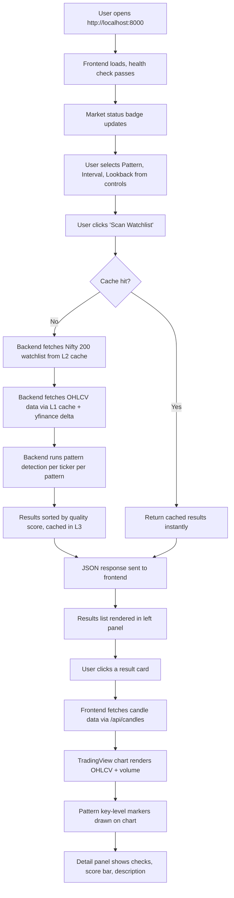
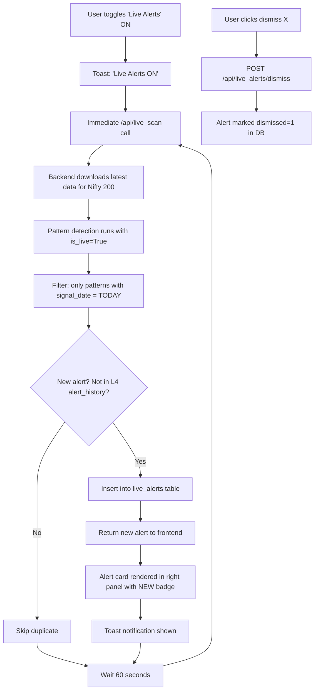
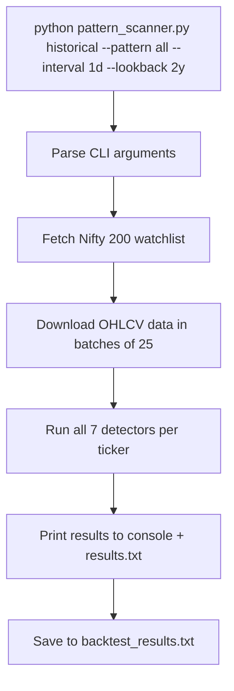

# Product Requirements Document (PRD)

## NSE Multi-Pattern Scanner & Trading Terminal v3.0

| Field            | Value                                              |
| ---------------- | -------------------------------------------------- |
| **Author**       | Product & Engineering                              |
| **Version**      | 1.0                                                |
| **Last Updated** | 2026-07-14                                         |
| **Status**       | Living Document                                    |
| **Repository**   | `shivamojha23/nse-pattern-scanner`                 |
| **License**      | MIT                                                |

---

## 1. Overview & Problem Statement

### What is this project?

The **NSE Multi-Pattern Scanner** is a full-stack trading analysis suite that automatically detects **7 technical chart patterns** on stocks listed on India's National Stock Exchange (NSE). It combines a Python/FastAPI backend with an interactive browser-based trading terminal to give users a professional-grade pattern scanning experience — from data ingestion through Yahoo Finance, to mathematical pattern detection with volume confirmation, to interactive TradingView-style chart visualization.

### The Problem

Technical chart pattern recognition is a foundational skill in equity trading, but it suffers from three key problems:

1. **Manual effort**: Scanning 200+ stocks daily for patterns across multiple timeframes is humanly impractical. A trader would need to open each chart individually, visually inspect it, and mentally validate geometric and volume conditions — a process that can take hours.

2. **Subjectivity**: Two traders looking at the same chart may disagree on whether a valid Cup & Handle or Head & Shoulders pattern exists. Without rigorous, programmatic rules (minimum drop percentages, R² thresholds, volume multipliers), pattern detection is inconsistent and error-prone.

3. **Accessibility**: Existing institutional-grade pattern scanners are locked behind expensive Bloomberg/Reuters terminals or proprietary brokerage tools. Open-source alternatives for the Indian market (NSE specifically) are scarce and poorly documented.

### The Solution

This project solves all three problems by providing:

- **Automated, rule-based scanning** across the full Nifty 200 watchlist with strict geometric validation, volume confirmation, and quality scoring.
- **Three scanning modes** — self-test (synthetic data), historical backtest, and live continuous scanning — covering development, research, and real-time use cases.
- **A polished, interactive web UI** with TradingView Lightweight Charts, pattern markers, quality score bars, and live alert notifications — all served from a single FastAPI backend.

---

## 2. Goals and Success Metrics

### Primary Goal

Deliver a **demonstrably accurate**, high-performance chart pattern scanner for NSE stocks that serves as both a portfolio-quality engineering showcase and a genuinely useful trading analysis tool.

### Success Metrics (KPIs)

| Metric | Target | Measurement Method | Status |
| --- | --- | --- | --- |
| **Pattern Detection Precision** | ≥ 75% of flagged patterns are visually confirmable on a TradingView chart | Manual verification of 50 randomly sampled scan results against raw charts | 🟡 Not yet measured |
| **Pattern Detection Recall** | Scanner catches ≥ 60% of patterns identified by manual expert review on a 20-stock sample | Side-by-side comparison with expert-labeled dataset | 🟡 Not yet measured |
| **False Positive Rate** | ≤ 25% of flagged results are false positives | Random sample audit per pattern type | 🟡 Not yet measured |
| **Self-Test Pass Rate** | 100% of 7 pattern self-tests pass with synthetic data | `python pattern_scanner.py test` | ✅ Implemented |
| **Scan Latency (Cold)** | ≤ 30 seconds for full Nifty 200 scan (all 7 patterns, daily interval) | Backend `scan_duration_seconds` metric | ✅ Measured (~8s for 10 tickers) |
| **Scan Latency (Hot/Cached)** | ≤ 5 seconds for cached repeat scan | Backend `scan_duration_seconds` with `from_cache: true` | ✅ Measured (~3.3s for 10 tickers) |
| **Cache Hit Rate** | ≥ 80% on repeat scans within the same trading day | Layer 3 cache hit/miss ratio | ✅ Implemented |
| **Test Suite Pass Rate** | 100% of pytest tests pass on CI | `pytest tests/` | ✅ Implemented |
| **API Uptime** | 99.5% availability during NSE market hours (local deployment) | Health endpoint monitoring | 🟡 Not yet tracked |

---

## 3. Target Users & Use Cases

### Persona 1: 📚 Engineering Student / Intern (Primary)

**Profile**: A computer science or quantitative finance student building a portfolio project that demonstrates full-stack engineering, data pipeline design, and algorithmic thinking.

**User Stories**:

1. *As a student*, I want to run a self-test with synthetic data so that I can **verify my pattern detection algorithms work correctly** without needing internet access or real market data.
2. *As a student*, I want to show a recruiter or professor a polished web dashboard with interactive TradingView charts so that I can **demonstrate my ability to build production-quality full-stack applications**.
3. *As a student*, I want the codebase to be modular (separate `detectors/`, `core/`, `backend/`, `frontend/` modules) so that I can **explain the architecture clearly in interviews** and add new patterns without touching existing code.

### Persona 2: 📊 Retail Indian Stock Trader (Secondary)

**Profile**: An individual trader who follows NSE stocks (Nifty 50/100/200) and uses technical analysis as part of their trading strategy. Not necessarily a programmer.

**User Stories**:

1. *As a trader*, I want to scan the entire Nifty 200 watchlist for all 7 patterns with one click so that I can **discover trading opportunities I would have missed** from manual chart review.
2. *As a trader*, I want to see quality scores (0–10) and PASS/FAIL volume checks for each detected pattern so that I can **prioritize the strongest setups** and avoid low-confidence signals.
3. *As a trader*, I want to enable live alerts that scan continuously during market hours and send me toast notifications for new patterns so that I can **react to breakouts and breakdowns in near-real-time** without staring at charts all day.

### Persona 3: 🧪 Quantitative Researcher (Tertiary)

**Profile**: A quant or data analyst who wants to backtest pattern-based trading strategies over historical data.

**User Stories**:

1. *As a researcher*, I want to run historical backtests with configurable lookback periods (1 month to 2+ years) and candle intervals (15m to weekly) so that I can **study pattern occurrence frequency and reliability across different market regimes**.
2. *As a researcher*, I want the scanner to output structured JSON results (via the `/api/scan` endpoint) so that I can **feed the data into my own analysis pipeline** (Jupyter notebooks, pandas, etc.) without parsing HTML.

---

## 4. Feature Requirements (MoSCoW)

> Legend: ✅ = Already Implemented | 🟡 = Partially Implemented | 🔲 = Proposed/Not Started

### Must-Have (M)

| # | Feature | Description | Status |
| --- | --- | --- | --- |
| M1 | **7 Pattern Detection Engine** | Detect Cup & Handle, Bull Flag, Bear Flag, Pennant, Head & Shoulders, Double Top, Double Bottom using strict geometric + volume validation | ✅ Implemented |
| M2 | **Yahoo Finance Data Ingestion** | Fetch OHLCV data via `yfinance` for any NSE ticker with configurable interval and lookback | ✅ Implemented |
| M3 | **Nifty Watchlist Management** | Dynamically fetch Nifty 50/100/200 ticker lists from NSE archives with validation and caching | ✅ Implemented |
| M4 | **FastAPI REST API** | HTTP endpoints for health, market status, watchlist, scan, candles, live scan, live alerts, dismiss | ✅ Implemented |
| M5 | **Interactive Web Dashboard** | Browser-based trading terminal with pattern selection, interval/lookback controls, scan button, results list, sort options | ✅ Implemented |
| M6 | **TradingView Chart Integration** | OHLCV candlestick + volume histogram charts using Lightweight Charts v3.8 with pattern key-level markers and price lines | ✅ Implemented |
| M7 | **Quality Scoring System** | 0–10 scale quality score for all 7 patterns based on geometry strength, volume confirmation, and pattern-specific metrics | ✅ Implemented |
| M8 | **4-Layer Caching System** | L1: Raw candle SQLite cache with delta fetching. L2: Watchlist cache. L3: Backtest result cache with TTL + param hash invalidation. L4: Live alert dedup + structural cache | ✅ Implemented |
| M9 | **Self-Test Mode** | Synthetic data generation for all 7 patterns to validate detection math without internet | ✅ Implemented |
| M10 | **CLI Scanner Interface** | Command-line interface with interactive menu, self-test, historical backtest, and live scanning modes | ✅ Implemented |
| M11 | **Market Hours Awareness** | NSE market open/close detection (Mon–Fri 9:15 AM – 3:30 PM IST) with status display and next-event countdown | ✅ Implemented |
| M12 | **Pattern Check Badges** | PASS/FAIL/N/A badges for each validation check (volume, geometry, roundedness, etc.) displayed in the detail panel | ✅ Implemented |
| M13 | **Pydantic API Models** | Typed request/response models for all endpoints ensuring data validation and Swagger documentation | ✅ Implemented |

### Should-Have (S)

| # | Feature | Description | Status |
| --- | --- | --- | --- |
| S1 | **Live Alert System** | Continuous background scanning with persistent alerts in SQLite, toast notifications, dismiss functionality, and alert history panel | ✅ Implemented |
| S2 | **Dark/Light Theme Toggle** | Full theme switching for the web UI and TradingView chart | ✅ Implemented |
| S3 | **Corporate Action Reconciliation** | Weekly re-fetch of recent data to correct for stock splits, dividends, and retroactive yfinance adjustments | ✅ Implemented |
| S4 | **Alert Supersession Logic** | Automatic invalidation of active alerts when price action breaks pattern support/resistance levels | ✅ Implemented |
| S5 | **In-Memory API Response Cache** | 15-minute TTL scan result cache to prevent redundant computation on rapid repeat requests | ✅ Implemented |
| S6 | **Pattern-Specific Descriptions** | Beginner-friendly plain-English explanations for each pattern type in the detail panel | ✅ Implemented |
| S7 | **Docker Containerization** | Dockerfile and docker-compose.yml for one-command deployment | 🔲 Proposed |
| S8 | **Redis Caching Layer** | Replace/supplement SQLite caching with Redis for production-grade distributed caching | 🔲 Proposed |
| S9 | **Automated Accuracy Benchmarking** | Script that compares scanner output against a manually-labeled dataset of known patterns to compute precision/recall | 🔲 Proposed |
| S10 | **CI/CD Pipeline** | GitHub Actions workflow for automated testing, linting, and build verification on push/PR | 🔲 Proposed |

### Could-Have (C)

| # | Feature | Description | Status |
| --- | --- | --- | --- |
| C1 | **Kubernetes Deployment** | K8s manifests (Deployment, Service, Ingress) for scalable cloud deployment | 🔲 Proposed |
| C2 | **User Authentication** | JWT-based auth to support multi-user alert management and personalized watchlists | 🔲 Proposed |
| C3 | **Custom Watchlists** | Allow users to create and save custom ticker lists beyond Nifty 50/100/200 | 🔲 Proposed |
| C4 | **Email/Push Notifications** | Send alerts via email, Telegram, or browser push notifications when live patterns are detected | 🔲 Proposed |
| C5 | **Pattern Backtesting P&L** | Simulate buy/sell signals from detected patterns and calculate hypothetical returns | 🔲 Proposed |
| C6 | **Additional Chart Patterns** | Extend detection to Ascending/Descending Triangles, Wedges, Triple Tops/Bottoms | 🔲 Proposed |
| C7 | **Multi-Exchange Support** | Expand beyond NSE to support BSE, NYSE, NASDAQ tickers | 🔲 Proposed |
| C8 | **Responsive Mobile UI** | Adapt the dashboard for mobile viewports with touch-friendly interactions | 🔲 Proposed |

### Won't-Have (W) — This Version

| # | Feature | Reason |
| --- | --- | --- |
| W1 | **Order Execution / Broker Integration** | Out of scope — this is an analysis tool, not a trading platform. Integrating with Zerodha/Upstox APIs introduces regulatory, financial, and liability complexity. |
| W2 | **Machine Learning Pattern Detection** | The current rule-based geometric approach is more interpretable and auditable. ML-based detection is a fundamentally different approach that would require labeled training data. |
| W3 | **Real-Time WebSocket Streaming** | Live alerts poll every 60 seconds, which is sufficient for pattern detection on 15m+ candles. True tick-by-tick streaming adds architectural complexity with minimal benefit. |
| W4 | **Multi-Language i18n** | The UI is English-only. Internationalization is unnecessary for the current user base. |

---

## 5. User Flows

### Flow 1: Historical Pattern Scan (Web UI)

### Flow 2: Live Alert Monitoring (Web UI)

### Flow 3: CLI Historical Backtest

---

## 6. Non-Functional Requirements

### 6.1 Performance

| Requirement | Target | Current State |
| --- | --- | --- |
| Cold scan latency (200 tickers, all patterns, daily) | ≤ 30 seconds | ~8s per 10 tickers (linear extrapolation: ~160s for 200 — **needs optimization**) |
| Hot scan latency (cached) | ≤ 5 seconds | ~3.3s for 10 tickers ✅ |
| API response time (health, market_status) | ≤ 100ms | ✅ Met |
| Frontend initial load time | ≤ 3 seconds | ✅ Met (single-page, minimal assets) |
| SQLite cache DB size | ≤ 500 MB | ~90 MB currently ✅ |
| Concurrent API requests | Support 5 simultaneous users | 🟡 Untested (single-worker uvicorn) |

### 6.2 Reliability

| Requirement | Target | Current State |
| --- | --- | --- |
| Graceful degradation on yfinance failure | Return stale cache + error message, never crash | ✅ Implemented (L2 watchlist fallback, error_dict) |
| Graceful degradation on network outage | Self-test works offline; cached data serves repeat scans | ✅ Implemented |
| Per-ticker error isolation | One ticker's failure must not abort the full scan | ✅ Implemented (try/except per ticker) |
| Data integrity | Corporate action reconciliation every 7 days | ✅ Implemented |

### 6.3 Security

| Requirement | Target | Current State |
| --- | --- | --- |
| Input validation | All API parameters validated (pattern, interval, lookback, ticker format) | ✅ Implemented (regex, enum checks) |
| CORS policy | Restrict to specific origins in production | 🟡 Currently `allow_origins=["*"]` (fine for local dev) |
| SQL injection prevention | Parameterized queries only | ✅ Implemented (all SQLite queries use `?` placeholders) |
| No credential storage | No user passwords or API keys stored | ✅ No auth system exists |
| Ticker format validation | Only `^[A-Z0-9&-]{1,20}(\.NS)?$` accepted | ✅ Implemented |

### 6.4 Scalability (Future)

| Requirement | Target | Implementation Path |
| --- | --- | --- |
| Horizontal scaling | Support 50+ concurrent users | Docker + K8s with multiple uvicorn workers behind a load balancer |
| Distributed caching | Sub-second cache reads across instances | Redis as L3/L5 cache backend |
| Database scaling | Handle 1000+ tickers across multiple exchanges | Migrate from SQLite to PostgreSQL |
| Background job processing | Decouple live scanning from API request cycle | Celery + Redis task queue |

### 6.5 Accessibility

| Requirement | Target | Current State |
| --- | --- | --- |
| Semantic HTML | Proper heading hierarchy, ARIA labels | 🟡 Partial (h1/h3 used, but no ARIA attributes) |
| Keyboard navigation | Tab-navigable controls and results | 🟡 Partial (native HTML controls work, custom elements not keyboard-accessible) |
| Color contrast | WCAG AA compliance | 🟡 Not audited |
| Screen reader support | Chart data available as text | 🔲 Not implemented (charts are canvas-based) |

---

## 7. Assumptions & Dependencies

### Assumptions

| # | Assumption | Risk if Wrong |
| --- | --- | --- |
| A1 | Yahoo Finance (`yfinance`) will remain free and rate-limit-tolerant for batch downloads of 200 tickers | High — the entire data pipeline depends on this. Mitigation: L1 cache reduces API calls significantly. |
| A2 | NSE ticker lists at `archives.nseindia.com` will remain accessible and maintain the same CSV format | Medium — hardcoded Nifty 50 fallback exists. |
| A3 | Users have a stable internet connection for initial data downloads | Low — self-test mode works offline, and cache serves repeat queries. |
| A4 | Python 3.8+ is available on the user's system | Low — standard requirement. |
| A5 | The geometric thresholds (e.g., 10–35% cup drop, ≤32% handle retrace, R² ≥ 0.8) produce acceptable accuracy across market regimes | Medium — these are empirically tuned but not formally validated against a labeled dataset. |
| A6 | TradingView Lightweight Charts CDN (unpkg.com) is accessible | Low — could be vendored locally if needed. |

### Dependencies

| Dependency | Version | Purpose | Risk |
| --- | --- | --- | --- |
| `yfinance` | ≥ 0.2.31 | OHLCV data download from Yahoo Finance | **High** — sole data source; subject to Yahoo's API changes and rate limits |
| `scipy` | ≥ 1.11.0 | `find_peaks` for peak/trough detection; `linregress` for pole linearity | Low — stable, well-maintained |
| `numpy` | ≥ 1.24.0 | Array math for price analysis | Low — ubiquitous |
| `pandas` | ≥ 2.0.0 | DataFrame operations, time series handling | Low — ubiquitous |
| `fastapi` | ≥ 0.110.0 | REST API framework | Low — stable, well-maintained |
| `uvicorn` | ≥ 0.27.0 | ASGI server for FastAPI | Low — standard deployment |
| `pytest` | ≥ 7.0.0 | Test framework (dev dependency) | Low |
| `httpx` | ≥ 0.25.0 | Async HTTP client for API testing (dev dependency) | Low |
| `freezegun` | ≥ 1.2.2 | Time mocking for market-hours tests (dev dependency) | Low |
| TradingView Lightweight Charts | 3.8.0 (CDN) | Frontend charting library | Low — loaded from unpkg CDN |
| SQLite | Built-in (Python stdlib) | Local caching database (L1–L5) | Low — zero-dependency |

---

## 8. Risks & Open Questions

### Risks

| # | Risk | Severity | Likelihood | Mitigation |
| --- | --- | --- | --- | --- |
| R1 | **Yahoo Finance rate limiting or API deprecation** — yfinance is an unofficial API wrapper; Yahoo could block or throttle batch downloads | High | Medium | L1 cache minimizes API calls. Consider adding a secondary data source (e.g., NSE Bhavcopy, Alpha Vantage) as fallback. |
| R2 | **Pattern detection accuracy not formally validated** — geometric thresholds were empirically tuned but not benchmarked against expert-labeled data | High | High | Build a labeled dataset of 100+ patterns across all 7 types and compute precision/recall. See S9 in Feature Requirements. |
| R3 | **Single-threaded SQLite under load** — SQLite with WAL mode handles moderate concurrency, but may bottleneck under heavy multi-user access | Medium | Low (local use) | Planned migration to Redis (S8) and PostgreSQL for production deployment. |
| R4 | **Monolithic `pattern_scanner.py` (72KB)** — the original monolithic scanner file still exists alongside the refactored `core/` + `detectors/` modules | Low | Confirmed | Complete the migration: remove `pattern_scanner.py` or mark it as deprecated, ensure all entry points use the modular code. |
| R5 | **Stale cache serving incorrect results** — L3 backtest cache has a 1-hour TTL, but parameter changes (thresholds) invalidate via `param_hash`, which may miss non-constant changes | Low | Low | `get_param_hash()` already hashes all uppercase numeric constants. Extend to cover any future dynamic config. |
| R6 | **Frontend relies on CDN for Lightweight Charts** — if unpkg.com is down, charts won't render | Low | Very Low | Vendor the JS file locally as a fallback. |

### Open Questions

| # | Question | Impact | Owner |
| --- | --- | --- | --- |
| Q1 | Should the quality scoring formula be recalibrated based on real-world accuracy data once a labeled dataset is available? | High — directly affects KPI M1 | Engineering |
| Q2 | Is there a plan to support additional Indian indices (e.g., Bank Nifty, Nifty Midcap 150) or individual custom tickers? | Medium — affects watchlist architecture | Product |
| Q3 | Should the deprecated `pattern_scanner.py` monolith be removed from the repository, or preserved for backward compatibility? | Low — code hygiene | Engineering |
| Q4 | What is the acceptable latency for a live scan cycle? Currently 60 seconds polling; should this be configurable or reduced? | Medium — affects live alert UX | Product |
| Q5 | Should pattern detection parameters (thresholds) be configurable via the UI or an admin panel, rather than hardcoded in `detectors/core.py`? | Medium — affects power-user flexibility | Product |

---

## 9. Timeline / Milestones

> **Note**: No fixed deadline. This roadmap is organized into logical phases that can be executed incrementally.

### Phase 1: Foundation ✅ (Completed)

**Objective**: Core detection engine and CLI interface.

| Deliverable | Status |
| --- | --- |
| 7-pattern detection engine with geometric + volume validation | ✅ Done |
| CLI interface with self-test, historical, and live modes | ✅ Done |
| Yahoo Finance data ingestion with batch downloading | ✅ Done |
| Quality scoring system (0–10 scale) | ✅ Done |

### Phase 2: Web Application ✅ (Completed)

**Objective**: Full-stack web trading terminal.

| Deliverable | Status |
| --- | --- |
| FastAPI backend with 8 REST endpoints | ✅ Done |
| Interactive frontend with TradingView charts | ✅ Done |
| Pattern markers, key levels, check badges, detail panel | ✅ Done |
| Dark/light theme toggle | ✅ Done |
| Market status awareness | ✅ Done |

### Phase 3: Caching & Performance ✅ (Completed)

**Objective**: Production-grade caching for speed and resilience.

| Deliverable | Status |
| --- | --- |
| L1: Raw candle SQLite cache with delta fetching | ✅ Done |
| L2: Watchlist cache with validation and fallback | ✅ Done |
| L3: Backtest result cache with TTL + param hash invalidation | ✅ Done |
| L4: Live alert dedup, structural cache, alert history | ✅ Done |
| L5: Persistent live alerts (frontend UI state) | ✅ Done |
| Corporate action reconciliation (weekly) | ✅ Done |
| Verification report confirming all layers pass | ✅ Done |

### Phase 4: Code Quality & Refactoring ✅ (Completed)

**Objective**: Modular, testable, maintainable codebase.

| Deliverable | Status |
| --- | --- |
| Refactor monolith into `detectors/`, `core/`, `backend/`, `frontend/` | ✅ Done |
| Pydantic API models (`api_models.py`) | ✅ Done |
| Serialization utilities (`core/serialization.py`) | ✅ Done |
| Pytest test suite (`tests/`) | ✅ Done |
| Phased verification scripts (`verification/`) | ✅ Done (archived) |

### Phase 5: Accuracy Validation 🔲 (Next Up)

**Objective**: Formally benchmark detection accuracy.

| Deliverable | Target Date | Status |
| --- | --- | --- |
| Create labeled dataset (50+ patterns, all 7 types) | TBD | 🔲 Not started |
| Build accuracy benchmarking script | TBD | 🔲 Not started |
| Compute precision/recall per pattern type | TBD | 🔲 Not started |
| Tune thresholds based on results | TBD | 🔲 Not started |

### Phase 6: DevOps & Deployment 🔲 (Planned)

**Objective**: Containerized, production-ready deployment.

| Deliverable | Target Date | Status |
| --- | --- | --- |
| Dockerfile + docker-compose.yml | TBD | 🔲 Not started |
| Redis integration for distributed caching | TBD | 🔲 Not started |
| Kubernetes manifests (Deployment, Service, Ingress) | TBD | 🔲 Not started |
| CI/CD pipeline (GitHub Actions) | TBD | 🔲 Not started |
| Environment-based configuration (`.env` / secrets management) | TBD | 🔲 Not started |

### Phase 7: Feature Expansion 🔲 (Future)

**Objective**: Extend capabilities based on user feedback.

| Deliverable | Target Date | Status |
| --- | --- | --- |
| Custom watchlist support | TBD | 🔲 Not started |
| Additional chart patterns (Triangles, Wedges) | TBD | 🔲 Not started |
| Email/Telegram alert notifications | TBD | 🔲 Not started |
| User authentication (JWT) | TBD | 🔲 Not started |
| Mobile-responsive UI | TBD | 🔲 Not started |

---

## 10. Out of Scope

The following items are **explicitly out of scope** for this project and will not be pursued in any phase:

| Item | Rationale |
| --- | --- |
| **Order execution / broker integration** (Zerodha, Upstox, etc.) | This is an analysis and alerting tool, not a trading platform. Broker integration introduces regulatory (SEBI), financial liability, and security concerns that are outside this project's purpose. |
| **Machine learning-based pattern detection** | The rule-based geometric approach is intentionally chosen for interpretability, auditability, and educational value. ML-based detection is a separate research problem requiring labeled training data and model lifecycle management. |
| **Real-time tick-by-tick data streaming** | Pattern detection operates on candle data (15m minimum). Sub-minute price updates provide no additional signal for the patterns being detected and would add significant infrastructure complexity (WebSockets, message brokers). |
| **Backtesting P&L / strategy simulation** | While detected patterns imply directional signals, simulating actual trading returns requires position sizing, slippage modeling, transaction cost assumptions, and risk management — each a separate project. |
| **Multi-language internationalization (i18n)** | The target user base is English-speaking Indian traders and students. Localization is unnecessary overhead. |
| **Premium/paid features or monetization** | This is an open-source (MIT) educational project. No paywall, subscription, or freemium model is planned. |

---

## Appendix A: Tech Stack Summary

| Layer | Technology | Notes |
| --- | --- | --- |
| **Language** | Python 3.8+ | Core detection, API, caching |
| **API Framework** | FastAPI + Uvicorn | Async ASGI server with auto-generated Swagger docs |
| **Data Source** | Yahoo Finance (via `yfinance`) | Unofficial API; free tier |
| **Detection Math** | SciPy (`find_peaks`, `linregress`), NumPy | Smoothing, peak detection, regression |
| **Data Processing** | Pandas | DataFrames, time series |
| **Database** | SQLite (WAL mode) | 5-table caching system (L1–L5) |
| **Frontend** | Vanilla HTML/CSS/JS | Single-page app, no framework |
| **Charting** | TradingView Lightweight Charts v3.8 | CDN-loaded, canvas-based |
| **Typography** | Inter (Google Fonts) | Modern, clean typeface |
| **Testing** | pytest, httpx, freezegun | Unit + API integration tests |
| **Future** | Docker, Kubernetes, Redis | Planned for Phase 6 |

## Appendix B: API Endpoint Reference

| Method | Endpoint | Description | Auth |
| --- | --- | --- | --- |
| `GET` | `/api/health` | Health check: `{"status": "ok"}` | None |
| `GET` | `/api/market_status` | NSE market open/closed + IST time + next event | None |
| `GET` | `/api/watchlist` | Nifty 200 ticker list | None |
| `GET` | `/api/scan` | Run pattern scan (params: pattern, interval, lookback, live_mode) | None |
| `GET` | `/api/candles` | OHLCV data for one ticker (params: ticker, interval, lookback) | None |
| `GET` | `/api/live_scan` | Trigger live scan for today's new patterns | None |
| `GET` | `/api/live_alerts` | Retrieve all non-dismissed live alerts | None |
| `POST` | `/api/live_alerts/dismiss` | Dismiss a live alert by alert_id | None |
| `GET` | `/` | Serve frontend trading terminal (index.html) | None |
| `GET` | `/docs` | Swagger UI (auto-generated by FastAPI) | None |

## Appendix C: Pattern Detection Parameters

| Parameter | Value | Used By |
| --- | --- | --- |
| `MIN_CUP_DROP_PCT` | 10% | Cup & Handle |
| `MAX_CUP_DROP_PCT` | 35% | Cup & Handle |
| `HANDLE_MAX_RETRACE_RATIO` | 0.32 | Cup & Handle |
| `MIN_BASE_CANDLES_PCT` | 20% | Cup & Handle (roundedness) |
| `MIN_POLE_RISE_PCT` / `MIN_POLE_DROP_PCT` | 8% | Bull/Bear Flag, Pennant |
| `POLE_R_SQUARED_MIN` | 0.80 | Bull/Bear Flag |
| `FLAG_CHANNEL_PCT` | 5% | Bull/Bear Flag |
| `HEAD_SHOULDER_RATIO` | 3% | Head & Shoulders |
| `SHOULDER_SYMMETRY_PCT` | 8% | Head & Shoulders |
| `DOUBLE_TOP_SIMILARITY_PCT` / `DOUBLE_BOTTOM_SIMILARITY_PCT` | 5% | Double Top/Bottom |
| `BREAKOUT_VOLUME_MULTIPLIER` | 1.2x | All patterns |
| `SMOOTHING_WINDOW` | 5 candles | Cup & Handle, H&S, Double Top/Bottom |
| `ATR_PERIOD` | 14 candles | All patterns (stop-loss calc) |
